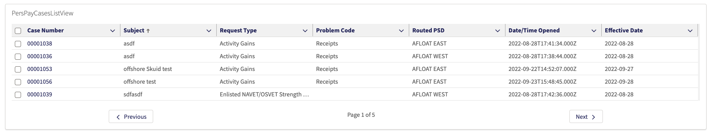
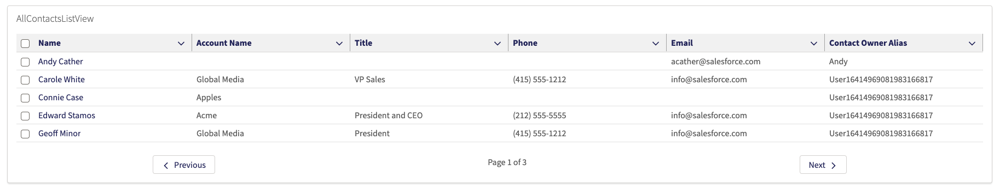
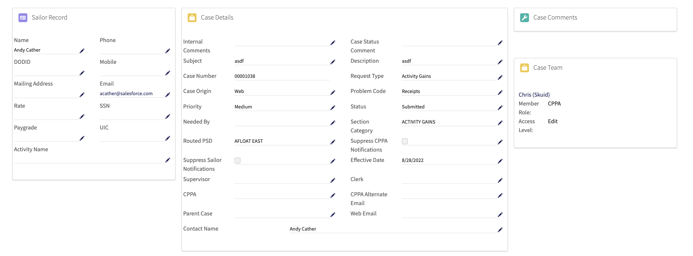
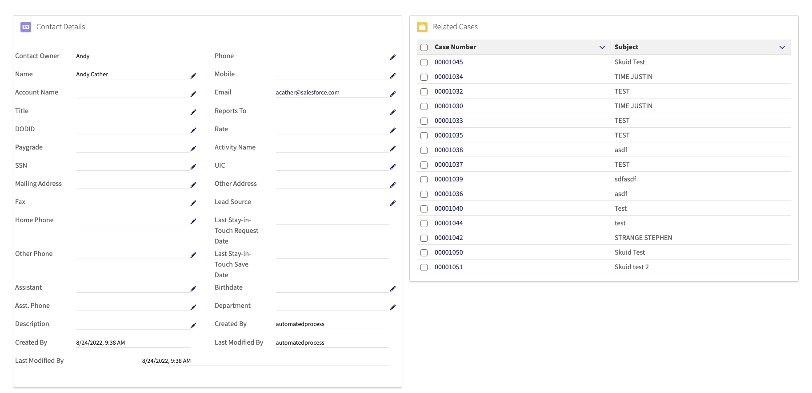

<h1 align="center">Lightning Web Runtime LWC Bundle</h1>
<p align="center">Check out <a href="https://drive.google.com/file/d/1VbQfmhJEjsgik_hThNH9XnlaDuD_GvkR/view"> this recording </a>from the EMEA Knowledge Sharing Day</p>

<p align="center">This unlocked package contains 8 (yes <b>8!</b>) various Lightning web components for Cases and Contacts, optimized to work on Salesforce Lightning Web Runtime (LWR) sites.  The package contains the following components: </p>


<b>Paginated Case List View</b>
 


<b>Paginated Contact List View</b>
 


<b>Case Detail, Case Teams, Case Comments, Related User</b>
 


<b>Contact Detail and Related Cases</b>
 


<!-- Sections below are Optional -->

---

## Summary


This component was created to reduce the latency and load time in low bandwidth Salesforce environments by creating Case and Contact pages as lightweight LWCs contained on a LWR site.  The load times you experience may vary, but testing these lightweight LWR pages compared to the Standard Lightning case and contact pages, there was a significant speed improvement on each of the LWR pages.  


## Speed Test Results

Speed testing for the components was done at 100 kb/s for each test.  The same contact list views and case records were used in each of the following tests.  The results for each load time were as follows:


<b>Standard Contact List View Page</b>

 


<b>LWR Contact List View Page</b>


<b>Standard Case Detail Page</b>

 


<b>LWR Case Detail Page</b>


From both test cases you can see that ~4.2 MB of data had been saved from transfer in each of the LWR cases, allowing a massive 5-6 minutes to be shaved off of the total page loading times in both cases.  This is extremely significant in a use case where necessary and time-sensitive data needs to be viewed in a low bandwidth connection environment.


## Component Setup and Overview

The package as a whole is pretty straightforward to setup, as it contains LWCs that will essentially drag and drop onto any LWR site.

Some code customization is required in version 1.0.0 in order to modify the fields displayed on the list view components.  Here is an example of how to update the fields displayed on the Case List View Component: 

Navigate to the CaseListContoller.cls file and modify the query line (line 5) to select the fields you want to display:

``` String query = 'SELECT Id, MyField1__c , MyField2__c FROM Case';```

Next, navigate to the caseListViewComponent.js file and update the const COLUMNS on line 12 to match the fields: 

```
const COLUMNS = [
    {label: 'Id', fieldName: 'Id', sortable:"true"},
    {label: 'MyField1', fieldName: 'MyField1__c', sortable:"true"},
    {label: 'MyField2', fieldName: 'MyField2__c', sortable:"true"}
]
  ```

Lastly, in the data.forEach loop on line 68, modify the loop to set the variables to the ones you want to query:

 ```
data.forEach((row) => {
    let rowData = {};
    rowData.Id=row.Id;
    rowData.MyField2__c = row.MyField1__c;
    rowData.MyField2__c = row.MyField2__c;

    currentData.push(rowData);
    console.log(`${JSON.stringify(rowData)}`);
});
```

These same steps can be repeated for modifying the contact list view fields.  A future release of this package will aim to solve this issue with a list view parameter on the component's config screen.

## Deploy this package

[Install the Package](https://login.salesforce.com/packaging/installPackage.apexp?p0=04t8a000001B8fxAAC)

## Maintainer

Jack Galletta, Public Sector Solution Engineer

Please feel free to Slack me with any questions about setup, configuration, or general improvements to the project.
