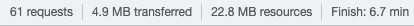
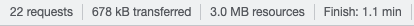

<h1 align="center">Lightning Web Runtime LWC Bundle</h1>

This unlocked package contains 8 (yes 8!) various Lightning web components for Cases and Contacts, optimized to work on Salesforce Lightning Web Runtime (LWR) sites.  The package contains the following components: Paginated List view for both Cases and Contacts, Case detail, Case Comments, Case Team, Case Related User Detail, Contact Detail, and Contact Related Cases List View.   

<!-- Sections below are Optional -->

---

## Summary

This component was created to reduce the latency and load time in low bandwidth Salesforce environments by creating Case and Contact pages as lightweight LWCs contained on a LWR site.  The load times you experience may vary, but testing these lightweight LWR pages compared to the Standard Lightning case and contact pages, there was a significant speed improvement on each of the LWR pages.  

## Speed Test Results

Speed testing for the components was done at 100 kb/s and the results for each load time were as follows:

<b>Standard Contact List View Page</b>

 

<b>LWR Contact List View Page</b>

## Flow Setup

The flow used here is super basic and consists of only 3 basic steps: rendering a button, calling our apex class, and then opening the URL with the <a href="https://unofficialsf.com/new-ways-to-open-web-pages-from-flow/">UnofficialSF OpenURL action</a>.

The only thing to note here is to ensure that you are passing the output parameters correctly to the openURL function like so:

## Deploy this package

## Maintainer

Jack Galletta, Public Sector Solution Engineer

Please feel free to Slack me with any questions about setup, configuration, or general improvements to the project.
