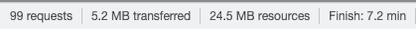
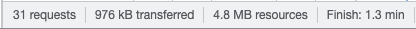

<h1 align="center">Lightning Web Runtime LWC Bundle</h1>

This unlocked package contains 8 (yes 8!) various Lightning web components for Cases and Contacts, optimized to work on Salesforce Lightning Web Runtime (LWR) sites.  The package contains the following components: Paginated List view for both Cases and Contacts, Case detail, Case Comments, Case Team, Case Related User Detail, Contact Detail, and Contact Related Cases List View.   

 

 

<!-- Sections below are Optional -->

---

## Summary

This component was created to reduce the latency and load time in low bandwidth Salesforce environments by creating Case and Contact pages as lightweight LWCs contained on a LWR site.  The load times you experience may vary, but testing these lightweight LWR pages compared to the Standard Lightning case and contact pages, there was a significant speed improvement on each of the LWR pages.  

## Speed Test Results

Speed testing for the components was done at 100 kb/s for each test.  The same contact list views and case records were used in each of the following tests.  The results for each load time were as follows:

<b>Standard Contact List View Page</b>

 

<b>LWR Contact List View Page</b>

<b>Standard Case Detail Page</b>

 

<b>LWR Case Detail Page</b>

From both test cases you can see that ~4.2 MB of data had been saved from transfer in each of the LWR cases, allowing a massive 5-6 minutes to be shaved off of the total page loading times in both cases.  

## Component Setup and Overview

The component as a whole is pretty straightforward to setup, as it contains components that will essentially drag and drop onto any LWR site.  Once you have configured a 

## Deploy this package

## Maintainer

Jack Galletta, Public Sector Solution Engineer

Please feel free to Slack me with any questions about setup, configuration, or general improvements to the project.
